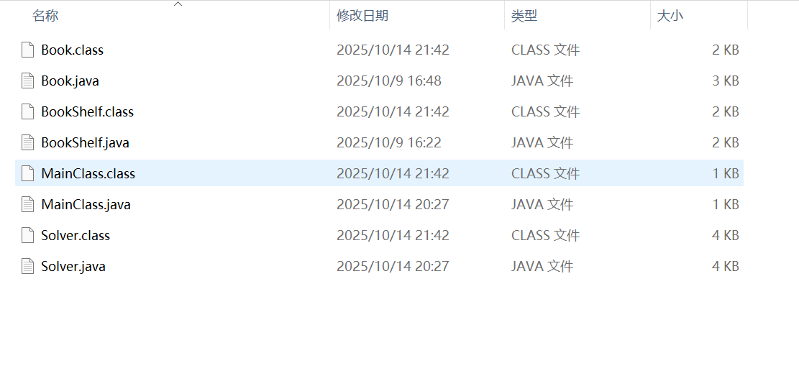
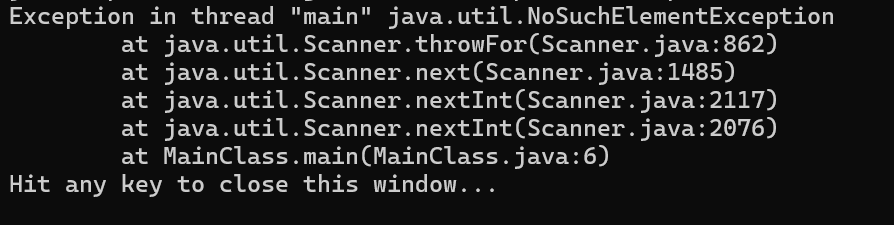

这应该是最最重要的吧。

Java 编译运行指令比较简单，比方说有一个叫做 `test.java` 的文件，可以直接这样：

```bash
javac test.java
java test
```

然后就会在当前目录下生成一个 `test.class` 的文件，运行的就是这个东西。

一个项目一般由不少于一个 `.java` 构成，然后还可能互相调用。我们发现如果对一个 `.java` 文件执行编译指令，只有它所有被直接或间接调用的的 `.java` 才有可能被编译。但是文件一多可能就变成了这样：



两种文件混杂在了一起，显然，这对于一个 Java 项目来说并不是一个好的方式，需要更优雅的方案。

来看看 IDEA 是如何解决的。假设当前项目为 `project` ，然后源代码应该放在 `project\src\` 里，然后编译之后的 `.class` 被放在了 `project\out\production\project\` 下面。

这就需要做一些字符串拼接啥的， `vimscript` 提供的一些内置函数还是比较多的，所以理论上可以直接通过修改 `vimrc` 来实现。

但是，由于后面可能还要加上 `Test` 类的编译运行，所以最终决定用 `C++` 写一个编译器状物。

在此之前，先来看看 `vimscript` 能做到什么。

`expand(str)` ：将 `str` 展开，比方说 `~` 会被展开成 `home` 路径的位置，`%` 会被展开成当前文件名， `%:p` 会被展开成带路径的文件名。

`tr(str,c1,c2)` ：把 `str` 里的 `c2` 全换成 `c1` 。

`printf()` ：就是按特定格式输出字符串，不过不是输出到屏幕上而是返回值是一个字符串。括号里面和 `C` 之类的语言差不多。

然后我的方案就是，把编译器放在 `~\vimfiles\compiler\` ，然后由于 `Java` 项目的格式比较固定，只要传一个项目 `src` 里文件的绝对路径，外加一个指令的参数就好了。然后编译器的名称叫 `java_compiler` ，所以在 `vimscript` 里面这样写：

```bash
#编译
if &filetype=='java'
	let exepath=tr(expand('~/vimfiles/compiler/java_compiler.exe'),'\','/')
	let cmd=printf("%s -c %s",exepath,expand('%:p'))
	exec "! ".cmd
endif
#运行
if &filetype=='java'
	let exepath=tr(expand('~/vimfiles/compiler/java_compiler.exe'),'\','/')
	let cmd=printf("%s -r %s",exepath,expand('%:p'))
	exec "! ".cmd
endif
```

如果编译器文件路径带有空格，可能要给 `cmd` 的第一个参数带上双引号，然后连带着编译器里面的一些细节也要改一下。

接下来就是编译器的实现了。由于具体编译运行配置可能有时候会改动，如果每次改动都改一下编译器的源代码，那一定是不优雅的。

一种更优雅的方式就是把配置存到 `.txt` 的文件里，然后如果要改就改 `.txt` 里面的内容。这里面的内容和指令基本一致，不过由于有时候一些具体的名称不太一样，所以可能要自定义一些东西。比如说定义 `%p` 表示项目名称， `%d` 表示项目所在的绝对路径， `%f` 表示调用编译指令的文件名称（这个是为了留给 `Test` 类用的）。还可以定义 `#` 表示注释，反正只要在编译器里面做一些字符串的拼接转换。

下面是编译和运行两个文件的内容。

`java_compile.txt` ：
```bash
if exist "%d\out\production\%p" rmdir %d\out\production\%p /s /q
mkdir %d\out\production\%p
javac -d %d\out\production\%p %d\src\MainClass.java
#javac -d %d\out\production\%p %d\src\*.java
```

`java_run.txt` ：
```bash
java -cp "%d\out\production\%p" MainClass
```

剩下的就是纯粹的 `C++` ，但任然有一些值得注意的地方。下面是一则我的小故事。

起初我写了一版编译器代码，编译是能过了，但是一运行，然后就爆炸了：



根据提示信息能判断出来时读入问题，然后我在网上搜了各种解决方案都没用。后来我把指令直接放在 `vimrc` 里面，发现竟然能用，这说明指令本身是对的。然后我又直接在编译器代码里面写指令，发现也是能用的（所以就得到了一种用 `C++` 调用 `Java` 程序的方式）。

很明显，是文件操作的问题。死因是我根据之前习惯用了 `freopen()` ，然后就导致输入重定向了，然后这会让 `Java` 里的 `Scanner(System.in);` 无法从控制台读入了。

总结一下就是读取 `.txt` 内容时不要重定向就行了，所以改成了 `fopen()` + `fgetc()` 。

```cpp
#include<iostream>
#include<cstdio>
#include<cstring>
using namespace std;
char d[114514],p[114514],f[114514];
char c[114514],cp[114514];
char z[114514];
FILE *fp;
int cmp(char *a,string b){
	int n=strlen(a);
	if(b.length()!=n) return 0;
	for(int i=0;i<n;i+=1){
		if(a[i]!=b[i]) return 0;
	}
	return 1;
}
void parse0(char *path){
	int n=strlen(path);
	while(n&&path[--n]!='/');
	for(int i=0;i<n;i+=1) cp[i]=path[i];
	cp[n++]='/'; cp[n]='\0';
	return;
}
void parse(char *path){
	int n=strlen(path),m=n,t,k=0;
	while(m&&path[--m]!='\\');
	for(int i=m+1;i<n;i+=1) f[k++]=path[i];
	f[k]='\0'; k=0; n=m;
	while(m&&path[--m]!='\\');
	for(int i=m+1;i<n;i+=1) c[k++]=path[i];
	c[k]='\0'; k=0; n=m;
	while(m&&path[--m]!='\\');
	for(int i=m+1;i<n;i+=1) p[k++]=path[i];
	p[k]=d[n]='\0';
	for(int i=0;i<n;i+=1) d[i]=path[i];
	return;
}
void solve(){
	char ch; int n=0;
	while(~(ch=fgetc(fp))){
		if(ch=='\n'){
			z[n]='\0'; n=0;
			if(z[0]!='#'){
				//printf("%s\n",z);
				system(z); //系暗示？！
			}
		}
		else if(ch=='%'){
			ch=fgetc(fp);
			if(ch=='d'){
				for(int i=0;d[i]!='\0';i+=1) z[n++]=d[i];
			}
			else if(ch=='p'){
				for(int i=0;p[i]!='\0';i+=1) z[n++]=p[i];
			}
			else if(ch=='f'){
				for(int i=0;f[i]!='\0';i+=1) z[n++]=f[i];
			}
		}
		else z[n++]=ch;
	}
	return;
}
int main(int argc,char *argv[]){
	parse0(argv[0]); parse(argv[2]);
	if(cmp(argv[1],"-c")){
		if(cmp(c,"src")){
			fp=fopen(strcat(cp,"java_compile.txt"),"r");
		}
		else if(cmp(c,"test")){
			//暂时留白
		}
	}
	else if(cmp(argv[1],"-r")){
		if(cmp(c,"src")){
			fp=fopen(strcat(cp,"java_run.txt"),"r");
		}
		else if(cmp(c,"test")){
			//暂时留白
		}
	}
	solve(); return 0;
}
```

文件路径有些地方用 `\` ，有些地方用 `/` ，所以可能混乱了点。