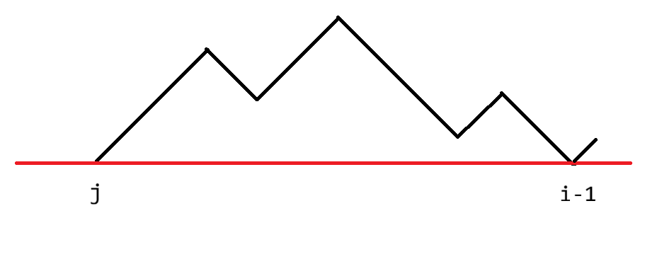
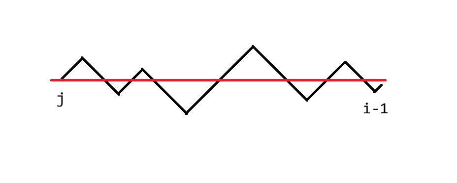
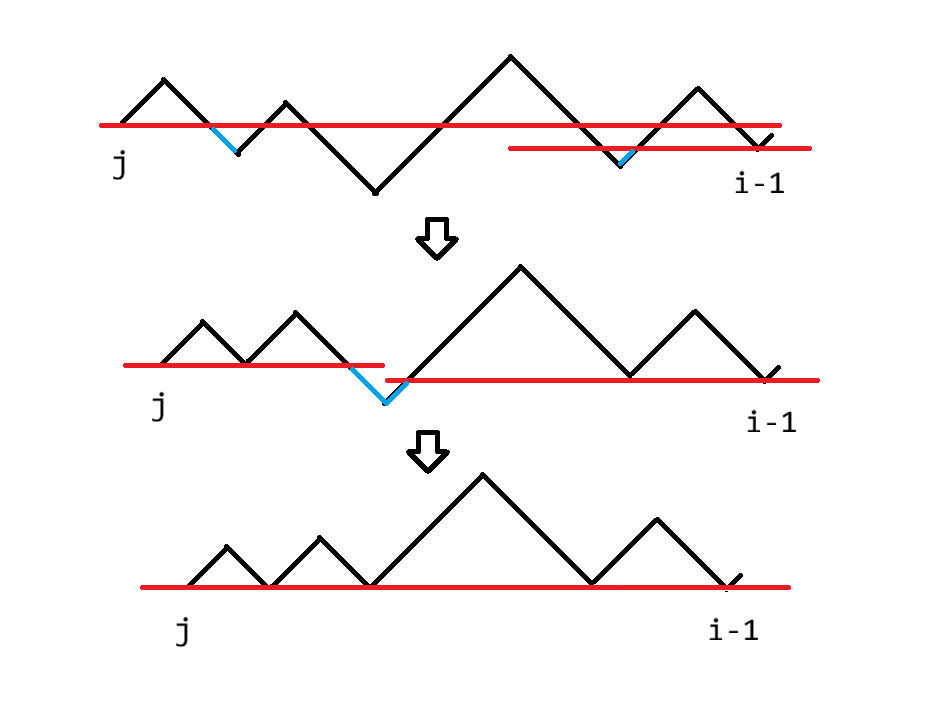

> 想了差不多一正节毛概课，出勤路上顺手敲掉了。

[Link](https://codeforces.com/contest/1366/problem/G)

首先根据 $s$ 生成一个数组 $a$ ，如果 $s_i$ 是字母，那么 $a_i=a_{i-1}+1$ ，否则 $a_i=a_{i-1}-1$ 。

现在考虑如果 $s_j$ 和 $s_i$ 对应 $t$ 中的两个相邻字母，然后一种比较理想的情况就是 $a_j=a_{i-1}$ 并且 $\forall k\in [j,i),a_k\ge a_j$ ，如下图：



然而事实上更多的情况长这样：



这时候就要动用删除操作了。在这种情况下，我们找到 $j$ 右边第一个对应 $a$ 更小的位置（如果存在），这个位置的字符必然是 `.` ，这时候把它删掉，重复这个过程直到不存在这个位置。对于 $i-1$ 前面比它小的位置同理，只不过删掉的就是字母了。



然后删除次数挺容易看出来的，假设 $[j,i)$ 之间 $a$ 的最小值为 $x$ ，那么删除次数就是 $a_j+a_{i-1}-2x$ 。

考虑 dp 。令 $f_{i,k}$ 表示考虑到 $s_i$ 且 $s_i$ 对应 $t_k$ 时最小要删的个数。然后如果 $s_i=t_k$ 就有

$$
f_{i,k}\leftarrow f_{j,k-1}+a_j+a_{i-1}-2x
$$

对于 $a_j$ 和 $a_{i-1}$ 显然是好处理的，关键是这个 $x$ 它会变化。其实可以用单调栈维护每个不同 $x$ 对应的连续段，然后只需要维护连续段里面 $f_{j,k}+a_j-2x$ 的最小值，以及一个整体的前缀最小值。

新增合并转移都暴力把 $\mathcal O(|t|)$ 个 $k$ 的不同值考虑一遍，总的操作次数均摊是 $\mathcal O(|s|)$ 的，所以时间就是 $\mathcal O(|s|\cdot|t|)$ 。
空间用 `short` 卡卡就可以了。

```cpp
#include<iostream>
#include<cstdio>
#include<cstring>
using namespace std;
int n,m;
char s[10005],t[10005];
int a[10005],stk[10005],top,ans;
short f[10005][10005],g[10005][10005],h[10005];
void solve(){
	scanf("%s%s",s+1,t+1);
	n=strlen(s+1); m=strlen(t+1);
	for(int i=1;i<=m;i+=1){
		f[1][i]=g[1][i]=g[0][i]=3*n+1;
	}
	stk[top=1]=0; g[0][0]=3*n+1;
	for(int i=1;i<=n;i+=1){
		if(s[i]=='.') a[i]=a[i-1]-1;
		else a[i]=a[i-1]+1;
		for(int j=0;j<m;j+=1){
			if(s[i]==t[j+1]&&g[top][j]!=3*n+1){
				h[j+1]=g[top][j]+a[i-1]-a[i];
			}
			else h[j+1]=3*n+1;
		}
		h[0]=3*n+1;
		while(top&&stk[top]>=a[i]){
			for(int j=0;j<=m;j+=1){
				if(f[top][j]!=3*n+1){
					short res=f[top][j]+(stk[top]-a[i])*2;
					h[j]=min(h[j],res);
				}
			}
			top-=1;
		}
		stk[++top]=a[i];
		for(int j=0;j<=m;j+=1){
			g[top][j]=min(g[top-1][j],f[top][j]=h[j]);
		}
	}
	ans=a[n]+g[top][m];
	printf("%d\n",ans);
	return;
}
int main(){
	solve();
	return 0;
}
```

Thanks~